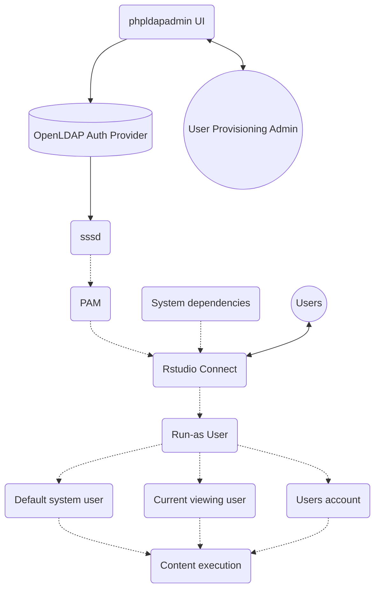

# Stream of consciousness openLDAP setup on an ec2 instance

What is LDAP?  [Lightweight Directory Access Protocol](https://ldapwiki.com/wiki/Lightweight%20Directory%20Access%20Protocol)

## Accessing the LDAP Instance: 
Access it at (change instance and ip as needed):
 - ec2-18-116-220-235.us-east-2.compute.amazonaws.com/phpldapadmin or 18.116.220.235/phpldapadmin (if associated with elastic ip)

The login name will be something like this (to match the ldif file org structure):
```
cn=admin,dc=example,dc=org
```

The password is what was used during ldap configuration

The EC2 instance had these ports opened (not all might be relevant):
 - 49155 (ldapadmin)
 - 686 (ldap)
 - 49153 (openldap)
 - 389 (ldap)

If you have an ssh tunnel set up you should also be able to connect to it on an appropriate port (eg like http://localhost:60339 )

## Overview 


Note: Dotted line indicates installation on RStudio Connect server side. 


## References
Overview of authentication on rsc: https://rstudiopbc.atlassian.net/wiki/spaces/SUP/pages/36244217/RSC+authentication

LDAP and RSC: https://support.rstudio.com/hc/en-us/articles/227010968-LDAP-and-Active-Directory-authentication-in-RStudio-Connect
Note that for this experiment we are going to be connecting ldap to pam via sssd, and not only using ldap (because we want run as user)

PAM and RSC: https://support.rstudio.com/hc/en-us/articles/226868627-PAM-authentication-in-RStudio-Connect (PAM interfaces with whatever you are using as a authentication database - in this case we are connecting to ldap)

Useful ubuntu page on setting up ldap: https://ubuntu.com/server/docs/service-ldap

openldap installation page (out of date but useful): https://www.techrepublic.com/article/how-to-install-openldap-on-ubuntu-18-04/

openldap setup walkthrough (out of date but useful, don't use the directory structure use the one from sol-eng-docker instead): https://www.youtube.com/watch?v=2r1VVJzY2Rw

A useful reference for the ldap structure is: https://tylersguides.com/guides/openldap-how-to-add-a-user/ 

Recommended page from Michael on modifying users: https://www.ibm.com/docs/en/noi/1.6.0?topic=ldap-creating-user-adding-user-group 

Various Ubuntu ldap docs: 
 - https://ubuntu.com/server/docs/service-ldap-usage
 - https://ldapwiki.com/wiki/Groups%20Are%20Bad
 - https://www.ibm.com/support/pages/add-ldap-users-members-ldap-static-groups

sol-eng-docker: 
 - generic open ldap server: https://github.com/rstudio/sol-eng-docker/blob/master/workshop/ldap.md 
 - User provisioning:  https://github.com/rstudio/sol-eng-docker/blob/master/cluster/users.ldif


## Installation
Let's start with our basic install of a bunch of system dependency stuff. This might not all be relevant: 
```
sudo apt-get update
sudo apt-get upgrade

sudo apt install libssl-dev libcurl4-openssl-dev openssl nano libxml2 libxml2-dev libuser1-dev

sudo apt-get install gdebi-core
sudo apt-get install -y libpng-dev

sudo apt-get install realmd sssd sssd-tools samba-common  samba-common-bin samba-libs adcli ntp nfs-common
```

and restart
```
sudo shutdown -r now
```

Install the ldap dependencies 
```
sudo apt install slapd ldap-utils
```

Let's define our admin password (be sure to write it down somewhere): 
```
sudo dpkg-reconfigure slapd 
```

Define an org name
```
dns name: example.org
organization name: example
```

Test if it was sucessfully installed: 
```
sudo tree /etc/ldap/slapd.d
```

Create the file for users and groups with sudo nano add_content.ldif
 - This is done using command line since it is faster. If you are doing something super custom or modifying the below you can continue doing this programmatically or through the GUI interface we will install later. A useful reference for the structure is: https://tylersguides.com/guides/openldap-how-to-add-a-user/ 
 - Reference the ldif file from sol-eng-docker: https://github.com/rstudio/sol-eng-docker/blob/master/cluster/users.ldif 
```
# LDIF Export for dc=example,dc=org
# Server: openldap (openldap)
# Search Scope: sub
# Search Filter: (objectClass=*)
# Total Entries: 16
#
# Generated by phpLDAPadmin (http://phpldapadmin.sourceforge.net) on October 26, 2018 5:05 pm
# Version: 1.2.3

version: 1

## Entry 1: dc=example,dc=org
#dn: dc=example,dc=org
#dc: example
#o: Example Inc.
#objectclass: top
#objectclass: dcObject
#objectclass: organization
#
## Entry 2: cn=admin,dc=example,dc=org
#dn: cn=admin,dc=example,dc=org
#cn: admin
#description: LDAP administrator
#objectclass: simpleSecurityObject
#objectclass: organizationalRole
#userpassword: {SSHA}+FquX8RcwTtBPo7mu2pgSvjaQYX9HpCL
#
# Entry 3: cn=engineering_group,dc=example,dc=org
dn: cn=engineering_group,dc=example,dc=org
cn: engineering_group
gidnumber: 501
memberuid: joe
memberuid: julie
objectclass: posixGroup
objectclass: top

# Entry 4: cn=finance_group,dc=example,dc=org
dn: cn=finance_group,dc=example,dc=org
cn: finance_group
gidnumber: 502
memberuid: bobo
memberuid: john
memberuid: ashley
objectclass: posixGroup
objectclass: top

# Entry 5: cn=rstudio-connect,dc=example,dc=org
dn: cn=rstudio-connect,dc=example,dc=org
cn: rstudio-connect
gidnumber: 500
objectclass: posixGroup
objectclass: top

# Entry 6: cn=support_group,dc=example,dc=org
dn: cn=support_group,dc=example,dc=org
cn: support_group
gidnumber: 503
memberuid: jen
memberuid: test
objectclass: posixGroup
objectclass: top

# Entry 7: dc=engineering,dc=example,dc=org
dn: dc=engineering,dc=example,dc=org
dc: engineering
description: The Engineering Department
o: Engineering
objectclass: dcObject
objectclass: organization
objectclass: top

# Entry 8: cn=joe,dc=engineering,dc=example,dc=org
dn: cn=joe,dc=engineering,dc=example,dc=org
cn: joe
gidnumber: 500
givenname: Joe
homedirectory: /home/joe
loginshell: /bin/sh
mail: joe@example.org
objectclass: inetOrgPerson
objectclass: posixAccount
objectclass: top
sn: Golly
uid: test\joe
uidnumber: 1000
userpassword: {MD5}j/MkifkvM0FmlL6P3C1MIg==

# Entry 9: cn=julie,dc=engineering,dc=example,dc=org
dn: cn=julie,dc=engineering,dc=example,dc=org
cn: julie
gidnumber: 500
givenname: Julie
homedirectory: /home/julie
loginshell: /bin/sh
mail: julie@example.org
objectclass: inetOrgPerson
objectclass: posixAccount
objectclass: top
sn: Jolly
uid: julie
uidnumber: 1001
userpassword: {MD5}FvEvXoN54ivpleUF6/wbhA==

# Entry 10: dc=finance,dc=example,dc=org
dn: dc=finance,dc=example,dc=org
dc: finance
description: The Finance Department
o: Finance
objectclass: dcObject
objectclass: organization
objectclass: top

# Entry 11: cn=ashley,dc=finance,dc=example,dc=org
dn: cn=ashley,dc=finance,dc=example,dc=org
cn: ashley
gidnumber: 500
givenname: Ashley
homedirectory: /home/ashley
loginshell: /bin/sh
mail: ashley@example.com
objectclass: inetOrgPerson
objectclass: posixAccount
objectclass: top
sn: Awesome
uid: ashley
uidnumber: 1006
userpassword: {MD5}rf9ExRAvyiefznVZq/Zv7g==

# Entry 12: cn=bobo,dc=finance,dc=example,dc=org
dn: cn=bobo,dc=finance,dc=example,dc=org
cn: bobo
gidnumber: 500
givenname: Bobo
homedirectory: /home/bobo
loginshell: /bin/sh
mail: bobo@example.org
objectclass: inetOrgPerson
objectclass: posixAccount
objectclass: top
sn: Momo
uid: bobo
uidnumber: 1002
userpassword: {MD5}BsVqiZSdYX3vUvNxw1e22w==

# Entry 13: cn=john,dc=finance,dc=example,dc=org
dn: cn=john,dc=finance,dc=example,dc=org
cn: john
gidnumber: 500
givenname: John
homedirectory: /home/john
loginshell: /bin/sh
mail: john@example.org
objectclass: inetOrgPerson
objectclass: posixAccount
objectclass: top
sn: Doe
uid: john
uidnumber: 1003
userpassword: {MD5}UnvVtdaJ4sMq6XTGIp/3hQ==

# Entry 14: dc=support,dc=example,dc=org
dn: dc=support,dc=example,dc=org
dc: support
description: The Support Department
o: Support
objectclass: dcObject
objectclass: organization
objectclass: top

# Entry 15: cn=jen,dc=support,dc=example,dc=org
dn: cn=jen,dc=support,dc=example,dc=org
cn: jen
gidnumber: 500
givenname: Jen
homedirectory: /home/jen
loginshell: /bin/sh
mail: jen@example.org
objectclass: inetOrgPerson
objectclass: posixAccount
objectclass: top
sn: Juniper
uid: jen
uidnumber: 1004
userpassword: {MD5}sY6kRVC2jQ0BK9kBfEqGSg==

# Entry 16: cn=test,dc=support,dc=example,dc=org
dn: cn=test,dc=support,dc=example,dc=org
cn: test
gidnumber: 500
givenname: Test
homedirectory: /home/test
loginshell: /bin/sh
mail: test@example.org
objectclass: inetOrgPerson
objectclass: posixAccount
objectclass: top
sn: Tester
uid: test
uidnumber: 1005
userpassword: {MD5}CY9rzUYh03PK3k6DJie09g==

# Entry 16: cn=bingo,dc=support,dc=example,dc=org
dn: cn=bingo,dc=support,dc=example,dc=org
cn: bingo
gidnumber: 500
givenname: Bingo
homedirectory: /home/bingo
loginshell: /bin/sh
mail: bingo@example.org
objectclass: inetOrgPerson
objectclass: posixAccount
objectclass: top
sn: Nameo
uid: bingo
uidnumber: 1008
userpassword: {MD5}OjeVu2HVN3VFtPNF/yI+PQ==

# groupOfNames
dn: cn=Example Group,dc=example,dc=org
cn: Example Group
member: cn=bingo,dc=support,dc=example,dc=org
member: cn=test, dc=support,dc=example,dc=org
objectClass: groupOfNames
```

Add the definitions to the ldap server: 
```
ldapadd -x -D cn=admin,dc=practice,dc=net -W -f add_content.ldif -c
```


## Modifications 
Modifications can be done using command line or through the GUI. If using the command line you could do something like the below to add a bunch more groups: 

sudo nano add_content8.ldif
```
dn: cn=group_1,dc=example,dc=org
cn: group_1
gidnumber: 600
memberuid: jen
memberuid: test
objectclass: posixGroup
objectclass: top

dn: cn=group_2,dc=example,dc=org
cn: group_2
gidnumber: 602
memberuid: jen
memberuid: test
objectclass: posixGroup
objectclass: top

dn: cn=group_3,dc=example,dc=org
cn: group_3
gidnumber: 603
memberuid: jen
memberuid: test
objectclass: posixGroup
objectclass: top

dn: cn=group_4,dc=example,dc=org
cn: group_4
gidnumber: 604
memberuid: jen
memberuid: test
objectclass: posixGroup
objectclass: top

dn: cn=group_5,dc=example,dc=org
cn: group_5
gidnumber: 605
memberuid: jen
memberuid: test
objectclass: posixGroup
objectclass: top

dn: cn=group_6,dc=example,dc=org
cn: group_6
gidnumber: 606
memberuid: jen
memberuid: test
objectclass: posixGroup
objectclass: top

dn: cn=group_7,dc=example,dc=org
cn: group_7
gidnumber: 607
memberuid: jen
memberuid: test
objectclass: posixGroup
objectclass: top

dn: cn=group_8,dc=example,dc=org
cn: group_8
gidnumber: 608
memberuid: jen
memberuid: test
objectclass: posixGroup
objectclass: top

dn: cn=group_9,dc=example,dc=org
cn: group_9
gidnumber: 609
memberuid: jen
memberuid: test
objectclass: posixGroup
objectclass: top

dn: cn=group_10,dc=example,dc=org
cn: group_10
gidnumber: 610
memberuid: jen
memberuid: test
objectclass: posixGroup
objectclass: top

dn: cn=group_11,dc=example,dc=org
cn: group_10
gidnumber: 610
memberuid: jen
memberuid: test
objectclass: posixGroup
objectclass: top

dn: cn=group_12,dc=example,dc=org
cn: group_10
gidnumber: 610
memberuid: jen
memberuid: test
objectclass: posixGroup
objectclass: top

dn: cn=group_13,dc=example,dc=org
cn: group_10
gidnumber: 610
memberuid: jen
memberuid: test
objectclass: posixGroup
objectclass: top

dn: cn=group_14,dc=example,dc=org
cn: group_10
gidnumber: 610
memberuid: jen
memberuid: test
objectclass: posixGroup
objectclass: top

dn: cn=group_15,dc=example,dc=org
cn: group_10
gidnumber: 610
memberuid: jen
memberuid: test
objectclass: posixGroup
objectclass: top

dn: cn=group_16,dc=example,dc=org
cn: group_10
gidnumber: 610
memberuid: jen
memberuid: test
objectclass: posixGroup
objectclass: top

```
ldapmodify -W -D cn=admin,dc=practice,dc=net  -f add_content8.ldif

Or something like: 

sudo nano add_content6.ldif
```
dn: cn=developers16,ou=Groups,dc=practice,dc=net
changetype: modify
add: member
member: uid=john,ou=People,dc=practice,dc=net
```
ldapmodify -W -D cn=admin,dc=practice,dc=net  -f add_content6.ldif


## Adding a GUI
Now let's  add a graphical interface. We'll be using phpldapadmin. 

First let's set a permission: 
```
sudo ufw allow ldap
```

Install the package: 
```
sudo apt-get install phpldapadmin
```

Modify configs: 
 - sudo nano /etc/phpldapadmin/config.php and search for `$servers->setValue('server','name'` with ctrl w
 - Change $servers->setValue('server','base', array('dc=example,dc=com')); to match our org earlier (dc=example,dc=org)
 - Comment out this line: #$servers->setValue('login','bind_id','cn=admin,dc=example,dc=com');
 - Uncomment this line and set it to true: $config->custom->appearance['hide_template_warning'] = true;

Let's navigate to our webpage
 - Format: https://example.com/phpldapadmin
 - In this case it will be: ec2-18-116-220-235.us-east-2.compute.amazonaws.com/phpldapadmin

The login name: 
```
cn=admin,dc=example,dc=org
```
The password is what we used before 

This guide is pretty good for interacting with our GUI: https://www.techrepublic.com/article/how-to-populate-an-ldap-server-with-users-and-groups-via-phpldapadmin/ 


## Flushing 
This didn't work: 
```
sudo ls -l /var/lib/openldap-data/
sudo rm -rf /var/lib/openldap-data/*
restart ldap 
sudo systemctl restart slapd
```

Ended up running: 
```
sudo dpkg-reconfigure slapd 
```


## Testing if it worked

Let's check if our user now exists:
```
ldapsearch -x -LLL -b dc=practice,dc=net '(uid=john)' cn gidNumber

ldapsearch -x -LLL -b dc=practice,dc=net '(uid=jane)' cn gidNumber

ldapsearch -x -LLL -b dc=practice,dc=net '(uid=julie)' cn gidNumber

ldapsearch -x -LLL -b dc=example,dc=org '(uid=jen)'
```

Let's list out the groups we have: 
```
ldapsearch -x -LLL -b dc=practice,dc=net '(objectClass=posixGroup)' cn gidNumber
```
